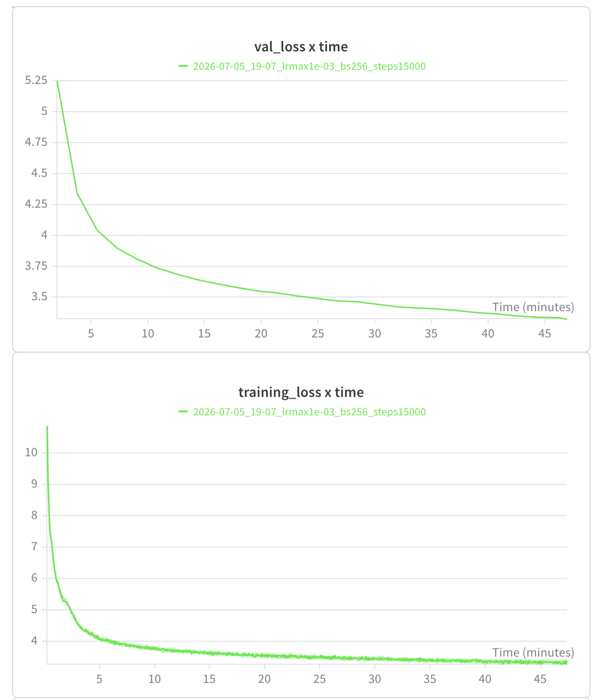

# building-llm-from-scratch

A decoder-only transformer language model built from scratch in PyTorch — the
tokenizer, model, optimizer, and training loop are all hand-implemented, with no
high-level language-modeling libraries. Trained on a subsample of OpenWebText.

> Built as my implementation of **Assignment 1** from Stanford's
> [CS336: Language Modeling from Scratch](https://stanford-cs336.github.io/)
> ([assignment repo](https://github.com/stanford-cs336/assignment1-basics)).

## What's implemented

Everything is written from the ground up — by hand, without a coding assistant
(matmuls via `einops`, no `nn.Transformer`):

- **Tokenizer** — byte-level BPE trainer plus encoder/decoder
  (`cs336_basics/train_bpe.py`, `cs336_basics/tokenizer.py`)
- **Model** (`cs336_basics/model.py`) — a decoder-only transformer with:
  - Rotary position embeddings (RoPE)
  - RMSNorm (pre-norm) and a SwiGLU feed-forward network
  - Multi-head self-attention with causal masking
  - Optional, config-toggled features:
    - **Weight tying** — share the input embedding and output projection matrices
    - **QK-norm** — RMSNorm applied to the query and key vectors before computing
      attention scores, which keeps the attention logits bounded and improves
      training stability at higher learning rates
    - **Wang initialization** — scales the output-projection init by
      `1 / sqrt(2 * num_layers)`, a depth-aware scheme that keeps residual-stream
      variance stable as the network deepens
    - **z-loss** — a small auxiliary loss on the softmax normalizer that discourages
      logit drift and further stabilizes training
- **Optimizer** — AdamW with a cosine learning-rate schedule, warmup, and gradient
  clipping (`cs336_basics/train.py`)
- **Training loop** (`cs336_basics/main.py`) — config-driven, with Weights & Biases
  logging, checkpointing, and mixed-precision training

## Requirements

- Python 3.12
- An NVIDIA GPU for training at scale (see [Performance](#performance))

## Setup

This project uses [`uv`](https://github.com/astral-sh/uv#installation) to manage the
environment for reproducibility and ease of use. Install it (recommended), or via
`pip install uv` / `brew install uv`.

Once `uv` is installed, you can run any file in the repo with:

```sh
uv run <path>
```

and the environment is resolved and activated automatically — no manual venv setup.
Every command below follows this pattern.

## Quickstart

### 1. Download the data

```sh
mkdir -p data && cd data

wget https://huggingface.co/datasets/stanford-cs336/owt-sample/resolve/main/owt_train.txt.gz
gunzip owt_train.txt.gz
wget https://huggingface.co/datasets/stanford-cs336/owt-sample/resolve/main/owt_valid.txt.gz
gunzip owt_valid.txt.gz

cd ..
```

(TinyStories is also supported as a smaller, faster dataset — download it from the
[TinyStories dataset](https://huggingface.co/datasets/roneneldan/TinyStories) into
`data/`, and see [Using TinyStories instead](#using-tinystories-instead) below.)

### 2. Encode the text into token IDs

Training reads pre-tokenized `uint16` arrays (`.npy`), not raw text. The trained
32K-vocab BPE tokenizer is committed under `outputs_owt/`, so you don't need to
retrain it — just encode the text you downloaded:

```sh
uv run python -m cs336_basics.encode_data
```

This writes `data/owt-train-encoded.npy` and `data/owt-valid-encoded.npy` — the
files the training config points to. If an input file is missing, the script exits
and tells you to run the download step first.

> **Note:** encoding the OpenWebText train split (~5 GB) holds the full token
> stream in memory before writing, so it needs a machine with substantial free RAM
> and takes a few minutes.

#### Using TinyStories instead

TinyStories is a smaller, faster dataset that's fully supported. Its 32K tokenizer
is committed under `outputs_tinystories/`, and ready-made configs live in
`configs/tinystories/`. To use it:

1. Download the TinyStories text (see the note in step 1) into `data/`.
2. In `cs336_basics/encode_data.py`, comment out `encoding_owt()` and uncomment
   `encoding_tinystories()` in the CONFIG section at the bottom, then run the same
   encode command above.
3. Train with a TinyStories config, e.g.:

   ```sh
   uv run python cs336_basics/main.py \
     --config configs/tinystories/small-run.yaml --run-name ts-run
   ```

### 3. Train

```sh
uv run python cs336_basics/main.py --config [config path] --run-name [run name]
```

For example, to train the leaderboard config:

```sh
uv run python cs336_basics/main.py \
  --config configs/owt/gpu-100m-wtying-1e3-b200-lowerminlr-512ctx-15000step.yaml \
  --run-name my-run
```

Configs live in `configs/owt/`. Each one sets the model size, LR schedule, batch
size, context length, and architecture toggles. You can override select fields from
the command line: `--lr-max`, `--lr-min`, `--steps`, `--batch-size`,
`--context-length`, `--run-name`.

Training logs to Weights & Biases — run `uv run wandb login` first, or set
`WANDB_API_KEY`.

To run without a Weights & Biases account, prefix the command with
`WANDB_MODE=disabled` (all W&B calls become no-ops):

```sh
WANDB_MODE=disabled uv run python cs336_basics/main.py --config [config path] --run-name [run name]
```

## Training your own tokenizer (optional)

The 32K OpenWebText tokenizer is already committed in `outputs_owt/`, so most users
never need this. To retrain, edit the clearly marked CONFIG section at the bottom of
`cs336_basics/train_bpe.py` (dataset path, output folder, vocab size), then:

```sh
uv run python cs336_basics/train_bpe.py
```

By convention the tokenizer is trained on the **train** split (the default).

## Performance

Training is optimized for modern NVIDIA GPUs. When CUDA is available, the training
loop automatically enables:

- **BF16 autocast** for the forward pass (loss and master weights stay in FP32)
- **TF32 matmuls** (`torch.set_float32_matmul_precision("high")`)
- **`torch.compile`**

Together these give a large throughput improvement over a plain FP32 baseline. On
CPU or Apple MPS the code falls back to full-precision execution, so it still runs
(just slowly) for local debugging.

## Results

The `~80M`-parameter configuration
(`configs/owt/gpu-100m-wtying-1e3-b200-lowerminlr-512ctx-15000step.yaml`) was
trained on a single B200 within a 45-minute budget at context length 512:

| Metric | Value |
| :--- | ---: |
| Validation loss (CE) | **3.33684** |
| Validation perplexity | 28.1 |
| Steps in 45 min | ~10,245 |
| Tokens seen | ~1.36B |

- Learning curve: [W&B report](https://api.wandb.ai/links/enho-/49shjsgy)
- Submitted to the [CS336 Assignment 1 leaderboard](https://github.com/stanford-cs336/assignment1-basics-leaderboard)
  ([submission PR](https://github.com/stanford-cs336/assignment1-basics-leaderboard/pull/188), pending review as of July 2026).



## Repository layout

```
cs336_basics/          model, tokenizer, optimizer, training loop, data encoding
configs/               training configs (owt/ and tinystories/)
scripts/               environment setup (e.g. cloud GPU pod setup)
tests/                 unit tests
outputs_owt/           committed 32K BPE tokenizer for OpenWebText
outputs_tinystories/   committed BPE tokenizer for TinyStories
```

## Acknowledgments

This project began from the assignment scaffold for Stanford's
[CS336: Language Modeling from Scratch](https://stanford-cs336.github.io/). See
`LICENSE`.
